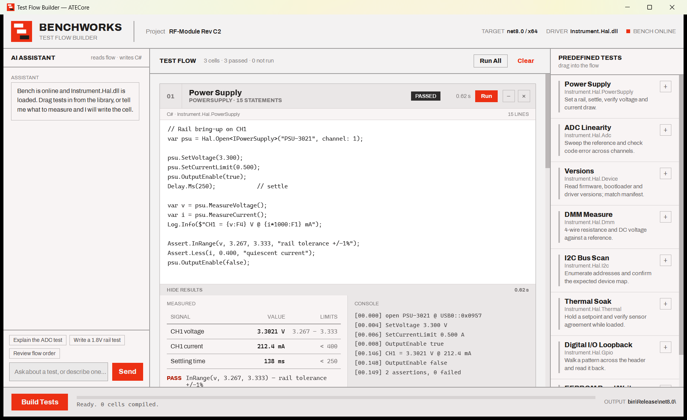

# Test Flow Builder

A Windows desktop app for building and running hardware test flows. Each test is a C# cell you can edit, run against the
bench and review, and the whole flow builds into a test assembly. It is a WPF (.NET 8) implementation of a design made in
Claude Design, styled with the Modernist design system: flat, square, 2px rules and a single red accent.



## Features

- **Test flow:** drag tests from the *Predefined Tests* library into the flow, or double-click / press `+` to append one.
- **C# cells:** every cell holds editable C# source, its driver, and a status (not run / running / passed).
- **Run results:** *Run* a cell or *Run All*; passed cells show measurements against limits, assertions and a console log.
- **Minimize:** collapse any cell with `−`, and hide just the results with the *Hide results* bar. Cells stay minimized across re-runs.
- **AI assistant:** ask about a test, or ask it to write one (for example *Write a 1.8V rail test*) and it appends the cell.
- **Build:** *Build Tests* shows build progress and status for the whole flow.

> **Status:** run results, the build and the assistant are simulated, exactly as in the design. Nothing compiles the C#
> cells or talks to `Instrument.Hal.dll` yet. See [Roadmap](#roadmap).

## Requirements

- Windows 10 / 11
- [.NET SDK 10.0.103](https://dotnet.microsoft.com/download) or newer 10.x (pinned in `global.json`); the app itself targets `net8.0-windows`, so the .NET 8 Desktop Runtime is needed to run a published build

## Run

```bash
dotnet run --project src/ATECore.TestFlowBuilder
```

Optional flags, matching the design's props:

| Flag | Effect |
| --- | --- |
| `--sample-flow` | Start with Power Supply, ADC Linearity and Versions already in the flow |
| `--auto-run` | Run a test as soon as it is added |
| `--project "Name"` | Project name shown in the header (default `RF-Module Rev C2`) |

```bash
dotnet run --project src/ATECore.TestFlowBuilder -- --sample-flow --project "My Board"
```

## Project layout

```
ATECore.slnx
Design/                          The Claude Design export this app implements (reference only)
docs/                            Screenshot
src/ATECore.TestFlowBuilder/
  Models/                        TestDefinition, TestLibrary (the canned tests, code and results)
  ViewModels/                    MainViewModel, TestCellViewModel, chat and commands (MVVM, no dependencies)
  Services/                      AssistantService (keyword replies), AppOptions (command-line flags)
  Views/                         MainWindow (three-column layout) and its drag-and-drop code-behind
  Themes/Modernist.xaml          Design tokens, button / input / scrollbar styles and the logo
  Assets/Fonts/                  Archivo (SIL Open Font License)
  Assets/Icons/                  App icon and logo
tools/make_icon.py               Regenerates the icon and logo files
```

## Logo and icon

A red tile with three cells stepping down and to the right, the last step in ink. `tools/make_icon.py` regenerates
`Assets/Icons/app.ico`, `logo.png` and `logo.svg` with no dependencies. The header logo (`LogoImage` in
`Themes/Modernist.xaml`) uses the same geometry.

```bash
python tools/make_icon.py
```

## Roadmap

- Compile cells for real (Roslyn) and emit the test assembly from *Build Tests*
- Run cells against `Instrument.Hal.dll` and show live measurements
- Connect the assistant to a model so it reads the flow and writes C#
- Save and load flows

## Credits

Font: [Archivo](https://github.com/Omnibus-Type/Archivo) by the Archivo Project Authors, under the SIL Open Font License 1.1
(`src/ATECore.TestFlowBuilder/Assets/Fonts/OFL.txt`).
